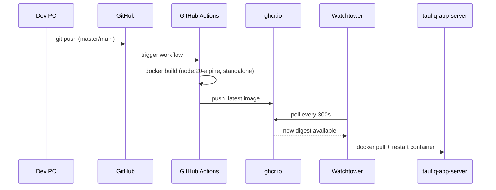
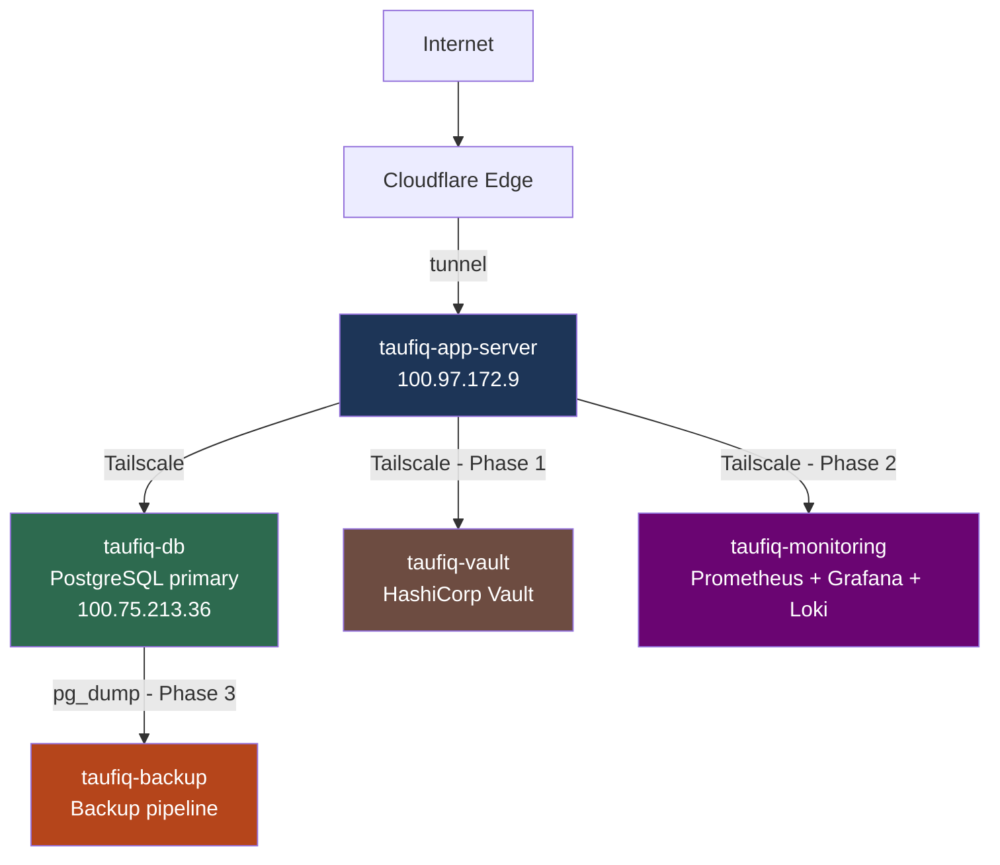

# Database Homelab Architecture

**Date:** 2026-05-02  
**Platform:** Proxmox VE on single-node homelab  
**Target use case:** Learn database infrastructure first, then attach your own apps  
**Hardware observed:** 4 vCPU, 7.65 GiB RAM, ~225 GiB disk

---

## Goal

Build a small but realistic database lab on your Proxmox host that lets you practice:

- PostgreSQL installation and hardening
- User and role management
- Backups and restore drills
- Monitoring and logging
- Replication and failover concepts
- Running one or more of your own apps against the database

This design favors depth over breadth. It is better to understand one database stack well than to install many services lightly.

---

## Important constraint

This is a **single physical Proxmox host**, so any HA you build is **educational HA**, not true infrastructure HA.

What that means:

- If one PostgreSQL VM fails, another VM can potentially take over
- If the Proxmox host itself fails, all VMs fail together

So the lab is still very useful for learning:

- replication
- failover
- backups
- observability
- recovery procedures

But it does **not** protect against full host failure.

---

## Current actual deployment

**Last updated: 2026-05-11**

The homelab now has two active VMs and two live deployed applications.

### Active VMs

| VM name | Guest hostname | Tailscale IP | Role | RAM |
|---|---|---|---|---|
| `db-server` | `taufiq-db` | `100.75.213.36` | PostgreSQL 16 primary | 2 GiB |
| `app-server` | `taufiq-app-server` | `100.97.172.9` | Docker host, Cloudflare Tunnel | 2 GiB |

Both VMs are connected to each other via Tailscale. The app server reaches PostgreSQL at `100.75.213.36:5432`.

```
Internet
    │
    ▼
Cloudflare Edge  (free HTTPS, DDoS protection)
    │  cloudflared systemd service
    ▼
taufiq-app-server  100.97.172.9
  ├── templatehub        :3000 ──► templatehub.tttaufiqqq.com
  ├── admin-templatehub  :3001 ──► admin.tttaufiqqq.com
  └── watchtower              ──► polls ghcr.io every 300s
    │
    │  Tailscale
    ▼
taufiq-db  100.75.213.36
  └── PostgreSQL 16  :5432
```

### Running containers on app-server

| Container | Image | Host port | Public URL |
|---|---|---|---|
| `templatehub` | `ghcr.io/tttaufiqqq/templatehub:latest` | 3000 | templatehub.tttaufiqqq.com |
| `admin-templatehub` | `ghcr.io/tttaufiqqq/admin-templatehub:latest` | 3001 | admin.tttaufiqqq.com |
| `watchtower` | `containrrr/watchtower` | — | auto-deploys on new image push |

Both apps share the same PostgreSQL database (`templatehub`) on `taufiq-db`.

### CI/CD pipeline

Push to GitHub → GitHub Actions builds Docker image → pushes to ghcr.io → Watchtower polls every 300s → auto-redeploys.



### Cloudflare tunnel

Public HTTPS routing without opening any ports. Tunnel runs as a systemd service on app-server, routes both subdomains to their respective container ports.

---

## Recommended architecture roles

Start with three logical roles:

1. `pg-primary`  
   Main PostgreSQL server. This is where you do most of your learning and where your apps will connect first.

2. `pg-replica`  
   Secondary PostgreSQL server for streaming replication and failover practice.

3. `ops-box`  
   Small utility machine or container for monitoring, backup orchestration, admin tools, and experiments that should not live on the database server itself.

### How this maps to your current homelab

Right now you do **not** have all three roles yet.

Your current actual environment is:

- Proxmox VM name: `db-server`
- guest hostname: `taufiq-db`
- current role in practice: `pg-primary`

So at the moment:

- `db-server` = your real current PostgreSQL server
- `pg-primary` = the logical role that `db-server` is currently filling
- `pg-replica` = a future planned VM, not created yet
- `ops-box` = a future planned VM or LXC, not created yet

These names are meant as role labels, not claims that those machines already exist.

---

## Suggested VM sizing

Given your hardware, keep the footprint tight.

### Option A — Best balance

| Role | vCPU | RAM | Disk | Notes |
|---|---:|---:|---:|---|
| `pg-primary` | 2 | 3.5 GiB | 60-80 GiB | Main database VM. Today this role is filled by `db-server` |
| `pg-replica` | 1 | 2 GiB | 40-60 GiB | Streaming replica |
| `ops-box` | 1 | 1 GiB | 20-30 GiB | Monitoring, exporters, backup scripts |

This is the most practical layout for your current host.

### Option B — Start simpler

If you want less operational overhead at first:

| Role | vCPU | RAM | Disk | Notes |
|---|---:|---:|---:|---|
| `pg-primary` | 2 | 4 GiB | 80 GiB | Main DB. Today this role is filled by `db-server` |
| `ops-box` | 1 | 1 GiB | 20-30 GiB | Monitoring and tooling |

Then add `pg-replica` later once the primary is stable.

---

## VM vs LXC recommendation

Use:

- **VMs** for `pg-primary` and `pg-replica`
- **LXC or small VM** for `ops-box`

Why:

- PostgreSQL learning is cleaner in full VMs
- replication and failure drills feel more realistic
- you avoid container-specific behavior confusing the database lessons

---

## Network layout

Use a simple private LAN inside your homelab and keep the database off broad exposure.

### Recommended pattern

- Proxmox bridge: your normal LAN bridge
- Static IP for each VM
- Tailscale only where remote admin access is needed
- PostgreSQL should bind only to what is necessary

Example:

| Host | Example name | Example IP | Purpose |
|---|---|---|---|
| Primary DB | `pg-primary` | `192.168.0.30` | Main PostgreSQL server |
| Replica DB | `pg-replica` | `192.168.0.31` | Standby PostgreSQL server |
| Ops node | `ops-box` | `192.168.0.32` | Monitoring and admin tools |

### Access policy

- SSH only from trusted admin devices
- Prefer Tailscale for remote management
- PostgreSQL should not listen on `0.0.0.0` unless you deliberately need that
- Restrict PostgreSQL using both firewall rules and `pg_hba.conf`

---

## Storage layout

Keep it simple at first.

### Inside PostgreSQL

Use:

- default data directory for the main cluster
- WAL in the default layout initially
- additional tablespaces only when you are explicitly learning storage concepts

### In Proxmox

Reserve disk for:

- OS
- PostgreSQL data
- backups
- snapshots only when needed

Important note:

Snapshots are useful for lab rollback, but they are **not backups**. Do not treat a VM snapshot as your database backup strategy.

---

## Software stack recommendation

### Core

- Ubuntu Server 24.04 LTS
- PostgreSQL 16 or current stable version you want to standardize on

### On `pg-primary`

- PostgreSQL server
- `postgresql-contrib`
- basic log rotation and system monitoring tools

### On `pg-replica`

- PostgreSQL server
- replication user and streaming replication config

### On `ops-box`

- Prometheus
- Grafana
- postgres exporter
- optional: pgAdmin
- optional: backup automation scripts

If you want to stay lightweight, you can skip pgAdmin at first and do everything through `psql`.

---

## Security baseline

You already started this well. Keep going with a consistent model.

### Host and access

- SSH key auth only
- Disable password SSH login
- Use Tailscale for remote admin where possible
- Basic firewall rules on each VM

### PostgreSQL

- Bind only to the required interfaces
- Use least-privilege roles
- Separate app users from admin users
- Avoid using `postgres` for application access
- Use strong passwords or certificate-based auth later if you want to go deeper

### Account model

Recommended role shape:

- `postgres` only for local superuser/admin work
- one admin role for your own DBA tasks
- one app role per application
- one read-only/reporting role where needed
- one replication role for standby setup

---

## Build order

Follow this order so each layer gives you something useful before adding the next one.

### Phase 1 — Base infrastructure

1. Use your existing `db-server` VM as `pg-primary`
2. Install Ubuntu Server
3. Apply OS updates
4. Set static IP or DHCP reservation
5. Harden SSH
6. Install Tailscale if desired
7. Install PostgreSQL
8. Confirm local-only connectivity and log locations

**Outcome:** one safe, manageable database VM

### Phase 2 — Single-node database operations

1. Create one practice database
2. Create admin, app, and read-only roles
3. Configure `pg_hba.conf`
4. Practice:
   - start/stop
   - config reload
   - parameter changes
   - logs
   - locks
   - tablespaces
   - vacuum
   - restore from simple dumps

**Outcome:** strong operational understanding of a standalone PostgreSQL node

### Phase 3 — Backups and restore drills

1. Implement logical backups with `pg_dump`
2. Add full-cluster backup practice with `pg_dumpall`
3. Store backups outside the DB VM if possible
4. Test restore into a fresh database
5. Document restore steps clearly

**Outcome:** you can recover, not just backup

### Phase 4 — Observability

1. Create `ops-box`
2. Install Prometheus and Grafana
3. Add postgres exporter
4. Build dashboards for:
   - connections
   - cache hit ratio
   - locks
   - replication lag
   - checkpoints
   - disk growth
5. Review PostgreSQL logs regularly

**Outcome:** you can see what the database is doing over time

### Phase 5 — Replication

1. Create `pg-replica`
2. Configure streaming replication
3. Create a dedicated replication role
4. Verify WAL shipping and replica replay
5. Test read-only queries on the replica

**Outcome:** you understand primary/standby behavior

### Phase 6 — Failover drills

1. Simulate primary failure
2. Promote the replica
3. Repoint client connections manually
4. Observe what breaks
5. Rebuild the old primary as a replica if desired

**Outcome:** you understand failover mechanics, not just replication setup

### Phase 7 — Attach your apps

1. Pick one real app you have built
2. Give it a dedicated database and role
3. Add migrations
4. Monitor its queries and connection behavior
5. Test backup and restore against app data

**Outcome:** your infra lab becomes relevant to your actual software

---

## What to avoid early

Do not start with:

- Patroni
- PgBouncer
- Kubernetes
- multi-engine database stacks
- automatic failover tooling
- sharding

These are useful later, but they add operational complexity before the fundamentals are solid.

For your hardware and current stage, the best move is:

- first learn PostgreSQL deeply
- then add one layer at a time

---

## Good first milestones

A solid first month would look like this:

### Week 1

- stable `pg-primary`
- SSH and network hardening
- PostgreSQL installed and documented

### Week 2

- roles, schemas, and security model
- practice labs for locks, logs, storage, and parameters
- one real app database created

### Week 3

- backup automation
- restore verification
- monitoring stack online

### Week 4

- `pg-replica` built
- streaming replication working
- manual failover test completed

---

## Success criteria

This homelab is successful if you can comfortably do the following without guessing:

- create and secure a PostgreSQL instance
- explain where the data lives on disk
- create databases, roles, and privileges cleanly
- take backups and restore them correctly
- inspect logs and identify issues
- detect lock contention and deadlocks
- set up a replica
- perform a controlled failover drill
- connect one of your apps using least-privilege credentials

---

## Planned next VMs (from homelab projects roadmap)

These VMs are planned but not yet created. Pre-work: resize both existing VMs from 2 GiB → 1 GiB each (actual usage is ~380 MB) before adding new ones.

| VM / LXC | Type | RAM | Role | Phase |
|---|---|---|---|---|
| `taufiq-vault` | VM | 512 MB | HashiCorp Vault (secrets management) | Phase 1 |
| `taufiq-monitoring` | LXC | 512 MB | Prometheus + Grafana + Loki | Phase 2 |
| `taufiq-backup` | LXC | 128 MB | pg_dump cron + restore drills | Phase 3 |

Total projected: ~4 GiB / 7.6 GiB with ballooning enabled.



## Recommended next step

**Pre-work + Phase 1: HashiCorp Vault.**

The primary is stable and has a real app workload (TemplateHub). Pre-work: resize both VMs from 2 GiB → 1 GiB (actual usage is ~380 MB each). Then create `taufiq-vault` and migrate TemplateHub secrets off `.env` files.

Pre-work:
1. Resize `taufiq-app-server` RAM: 2 GiB → 1 GiB (shutdown required)
2. Resize `taufiq-db` RAM: 2 GiB → 1 GiB (shutdown required)
3. Verify both VMs stable after resize
4. Then create `taufiq-vault`

---

## Summary

For your current Proxmox hardware, the best database homelab is:

- one main PostgreSQL VM
- secrets management with HashiCorp Vault
- observability with Prometheus + Grafana + Loki
- automated backup pipeline with restore drills
- strong documentation

This keeps the lab realistic, teaches the right fundamentals, and gives you a strong base for eventually hosting your own apps on top of it.
