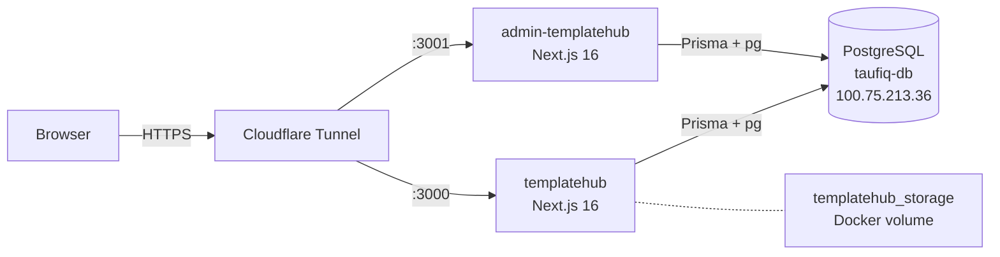
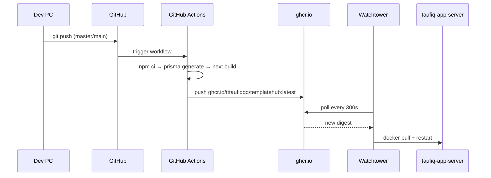

# TemplateHub

`TemplateHub` is the current real application paired with this homelab. It gives the database work a practical application context instead of keeping the lab purely infrastructure-only.

## Status — Live in Production (2026-05-11)

Both apps are deployed and publicly accessible via Cloudflare tunnel on the homelab app-server.

| App | URL | Repo |
|---|---|---|
| Customer storefront | templatehub.tttaufiqqq.com | tttaufiqqq/templatehub (branch: master) |
| Admin workspace | admin.tttaufiqqq.com | tttaufiqqq/admin-templatehub (branch: main) |

Both apps share the same PostgreSQL database (`templatehub`) on `taufiq-db` at `100.75.213.36:5432`.

## Architecture

**Split app design:** Customer storefront and admin panel are separate Next.js apps in separate repos, sharing one PostgreSQL database.

- `templatehub` — customer-facing: product catalog, cart, checkout, ToyyibPay payment, protected downloads
- `admin-templatehub` — admin-facing: product management, order review, payment inspection

**Migration ownership:** `templatehub` owns all Prisma migrations. `admin-templatehub` only runs `prisma generate` — never `migrate dev/reset`.

## Deployment Stack

**Infrastructure on `taufiq-app-server` (100.97.172.9):**
- Docker 29.4.3
- Cloudflare Tunnel → `templatehub.tttaufiqqq.com` (port 3000) + `admin.tttaufiqqq.com` (port 3001)
- `templatehub_storage` Docker volume → `/app/storage/product-assets` (protected downloads)
- Env files: `/home/taufiq/.env.templatehub`, `/home/taufiq/.env.admin-templatehub`

## Database

- **Host:** `taufiq-db` — `100.75.213.36:5432`
- **Database:** `templatehub`
- **App role:** `taufiq_dba` (to be replaced with a least-privilege app role — planned)
- **Migrations:** applied via `npm run db:deploy` from dev PC

## Next Steps for App Integration

| Priority | Task | Phase |
|---|---|---|
| High | Add product images to templatehub public folder + push | Now |
| High | Create least-privilege PostgreSQL role for TemplateHub (not taufiq_dba) | Now |
| Medium | Migrate .env secrets into HashiCorp Vault (taufiq-vault) | Phase 2 |
| Medium | Connect TemplateHub metrics to Prometheus (order rate, payment success/fail, downloads) | Phase 3 |
| Medium | Backup and restore drill against templatehub database | Phase 4 |
| Future | Point Prisma REPLICA_URL at taufiq-db-replica for read scaling | Phase 1 follow-up |

## Local Codebase References

- Customer app: `C:\Users\taufi\Documents\Dev\templatehub`
- Admin app: `C:\Users\taufi\Documents\Dev\admin-templatehub`

## Planning Docs

- [Codebase Reference](planning/codebase-reference.md)
- [Project Plan](planning/project-plan.md)
- [Project Specification](planning/project-specification.md)
- [ERD Diagram](planning/erd-diagram.md)
