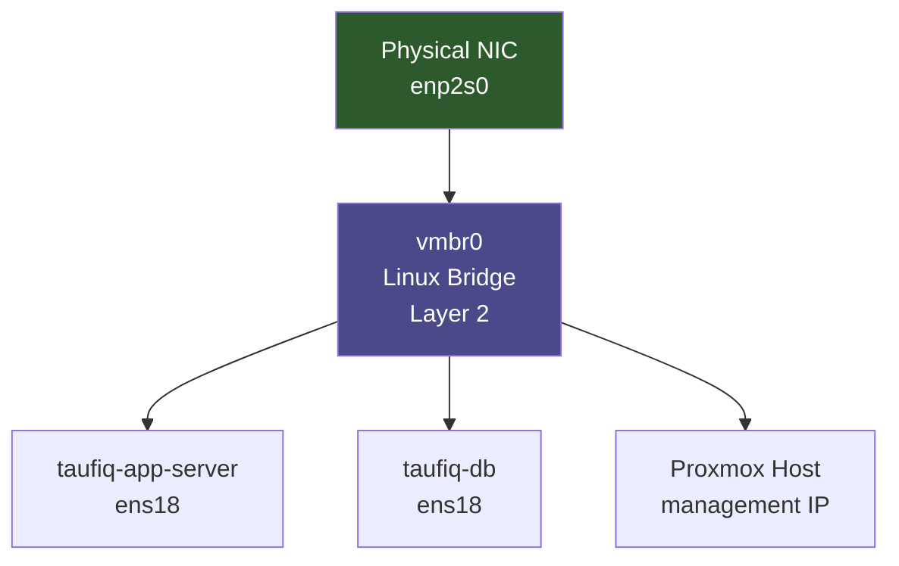

# Module 02 — Why: Proxmox Networking Internals

---

## Why we did this

Before changing anything in the network, we needed to understand what was already there. The homelab had two VMs running — but nobody had mapped how they actually connected to each other, what bridge they were on, or what would break if we moved them.

Skipping this step is how you break a running system without knowing why.

---

## Theory

### The OSI Model — where networking lives

Everything in this module operates at Layer 2 (Data Link) and Layer 3 (Network). Understanding which layer you are on tells you what tools and concepts apply.

```
OSI Layer    Name            What it carries        Tools / Concepts
─────────────────────────────────────────────────────────────────────
Layer 7      Application     HTTP, SSH, PostgreSQL  App-level protocols
Layer 4      Transport       TCP, UDP segments       Ports, connections
Layer 3      Network         IP packets              Routing, subnets, iptables
Layer 2      Data Link       Ethernet frames         MAC addresses, bridges, VLANs
Layer 1      Physical        Bits on wire            NICs, cables
```

A Linux bridge operates at **Layer 2** — it forwards Ethernet frames by MAC address, the same way a physical switch does. It has no concept of IP addresses. That is Layer 3 — handled by the kernel's routing stack above the bridge.

---

### How a Linux bridge works

A bridge connects multiple network interfaces at Layer 2. When a frame arrives on one port, the bridge looks up the destination MAC address in its forwarding table and sends it out the correct port.

```
Frame arrives on enp2s0 (physical NIC)
          |
          v
       [ vmbr0 ]  <-- Linux bridge
       /   |   \
      /    |    \
  VM1    VM2    VM3
 (tap0) (tap1) (tap2)

Bridge forwarding table (learned from traffic):
  MAC aa:bb:cc:11  --> VM1 (tap0)
  MAC aa:bb:cc:22  --> VM2 (tap1)
  MAC aa:bb:cc:33  --> VM3 (tap2)
```

Unknown destination? The bridge floods to all ports — same as a physical switch.

---

### TAP interfaces — how VMs attach to the bridge

Each VM's virtual NIC appears as a `tap` interface on the host. The VM thinks it has a real Ethernet NIC. The host sees it as a `tap` device, which is attached to the bridge.

```
Inside VM:                  Proxmox Host:
  ens18 (virtual NIC)  <-->  tap101i0  <-->  vmbr0
  "I'm sending a frame"      "tap device"    "bridge port"
```

The VM has no idea it is virtualised at the network layer. From its perspective, `ens18` is a real Ethernet card connected to a real switch.

---

### Three networking modes in Proxmox

| Mode | How it works | When to use |
|------|-------------|-------------|
| Bridged | VM is directly on the bridge — same network as the host | Most homelab setups |
| NAT | VM traffic is NATed through the host — VM has a private IP invisible to the network | Isolated VMs with outbound-only needs |
| Routed | Host routes packets to/from VM — no bridge, no NAT | Advanced setups, cloud-style networking |

This lab uses **bridged** mode — VMs are on the same bridge as the host NIC, giving them full network presence.

---

### How Tailscale sits on top

Tailscale creates a WireGuard tunnel interface (`tailscale0`) on each machine. It is a Layer 3 overlay — it does not interact with the bridge at all.

```
Layer 3 (IP routing):
  Destination 100.x.x.x  -->  via tailscale0 (WireGuard tunnel)
  Destination 10.0.30.x  -->  via vmbr0.30 (VLAN sub-interface)
  Destination 0.0.0.0/0  -->  via vmbr0 (default gateway)

Layer 2 (bridge):
  vmbr0 only handles local Ethernet frames
  tailscale0 is invisible to the bridge
```

This is why Tailscale keeps working regardless of what subnet changes happen — it's at a different layer.

---

## What the default Proxmox setup looks like

When Proxmox is installed, it creates one Linux bridge (`vmbr0`) and attaches it to the physical NIC. All VMs attach to the same bridge — same network, no separation.

```
Physical NIC (enp2s0)
        |
      vmbr0  <-- Linux bridge (layer 2 switch in software)
     /  |  \
   VM1 VM2  VM3     <- all on the same flat network
   :192.168.0.x     <- same subnet as your home devices
```

This is fine for getting started. It is not fine for a lab that teaches network segmentation.

---

## What a Linux bridge actually is

Most people think of a network switch as physical hardware. A Linux bridge is that — in software. It operates at Layer 2 (Ethernet frames), not Layer 3 (IP packets).



The bridge forwards Ethernet frames between all attached interfaces — just like a physical switch forwards frames between ports.

---

## Why this matters for what came next

Modules 03, 04, and 05 all depend on this foundation:

```
Module 02: audit the bridge, understand current state
    |
    v
Module 03: enable VLAN-aware mode on vmbr0 — now the bridge reads tags
    |
    v
Module 04: add sub-interfaces (vmbr0.20, vmbr0.30) — one per VLAN, each routable
    |
    v
Module 05: DNS server on one VLAN talks to VMs on another — needs routing to work
```

Without understanding Module 02, the changes in Module 03 would look like magic.

---

## What we gained

- Mapped the actual running state before touching anything
- Understood that vmbr0 is a software switch, not just an "interface"
- Understood the difference between bridged, NAT, and routed networking in Proxmox
- Confirmed Tailscale sits on top of the existing interfaces as an overlay — it does not replace them

---

## Why Proxmox specifically

Proxmox uses standard Linux networking under the hood — not a proprietary abstraction. Everything you learn here (bridges, VLANs, iptables) applies directly to any Linux server, not just Proxmox.

```
Proxmox UI changes  -->  edits /etc/network/interfaces
                                    |
                         same file you'd edit manually on any Debian/Ubuntu server
```

Learning through Proxmox means learning transferable Linux networking skills, not vendor-specific tooling.
