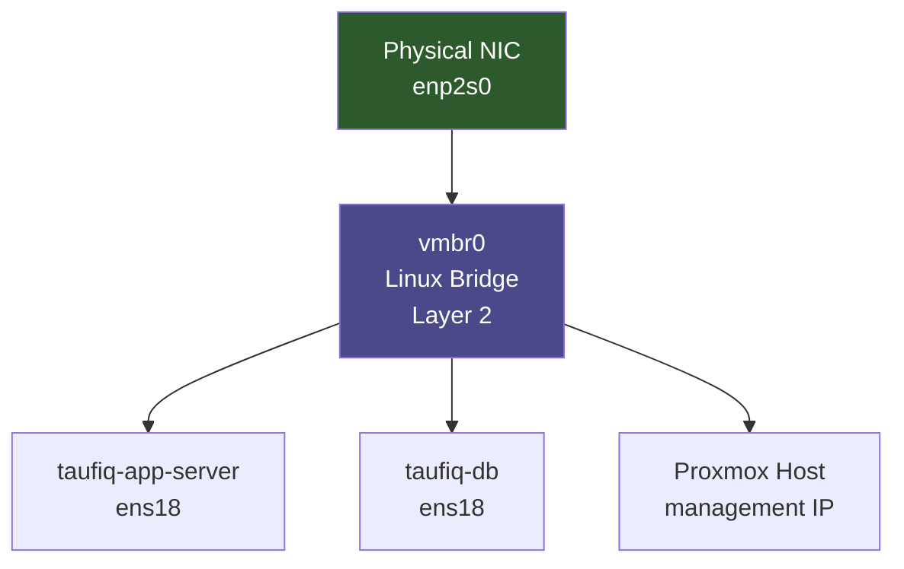

# Module 02 — Why: Proxmox Networking Internals

---

## Why we did this

Before changing anything in the network, we needed to understand what was already there. The homelab had two VMs running — but nobody had mapped how they actually connected to each other, what bridge they were on, or what would break if we moved them.

Skipping this step is how you break a running system without knowing why.

---

## What the default Proxmox setup looks like

When Proxmox is installed, it creates one Linux bridge (`vmbr0`) and attaches it to the physical NIC. All VMs attach to the same bridge — same network, no separation.

```
Physical NIC (enp2s0)
        |
      vmbr0  <-- Linux bridge (layer 2 switch in software)
     /  |  \
   VM1 VM2  VM3     <- all on the same flat network
   :192.168.0.x     <- same subnet as your home devices
```

This is fine for getting started. It is not fine for a lab that teaches network segmentation.

---

## What a Linux bridge actually is

Most people think of a network switch as physical hardware. A Linux bridge is that — in software. It operates at Layer 2 (Ethernet frames), not Layer 3 (IP packets).



The bridge forwards Ethernet frames between all attached interfaces — just like a physical switch forwards frames between ports.

---

## Why this matters for what came next

Modules 03, 04, and 05 all depend on this foundation:

```
Module 02: audit the bridge, understand current state
    |
    v
Module 03: enable VLAN-aware mode on vmbr0 — now the bridge reads tags
    |
    v
Module 04: add sub-interfaces (vmbr0.20, vmbr0.30) — one per VLAN, each routable
    |
    v
Module 05: DNS server on one VLAN talks to VMs on another — needs routing to work
```

Without understanding Module 02, the changes in Module 03 would look like magic.

---

## What we gained

- Mapped the actual running state before touching anything
- Understood that vmbr0 is a software switch, not just an "interface"
- Understood the difference between bridged, NAT, and routed networking in Proxmox
- Confirmed Tailscale sits on top of the existing interfaces as an overlay — it does not replace them

---

## Why Proxmox specifically

Proxmox uses standard Linux networking under the hood — not a proprietary abstraction. Everything you learn here (bridges, VLANs, iptables) applies directly to any Linux server, not just Proxmox.

```
Proxmox UI changes  -->  edits /etc/network/interfaces
                                    |
                         same file you'd edit manually on any Debian/Ubuntu server
```

Learning through Proxmox means learning transferable Linux networking skills, not vendor-specific tooling.
