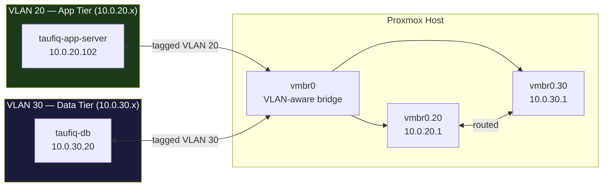

# Module 03 — Why: VLANs & Network Segmentation

---

## Why we did this

Before this module, both VMs sat on the same flat `192.168.0.x` network as every other device in the house — laptops, phones, printers. The database was as reachable as any home device. That is not how production infrastructure works.

The goal was to make the network reflect real-world architecture: the app tier and the data tier on separate networks, with controlled access between them.

---

## The problem with a flat network

```
Before VLANs — flat 192.168.0.x:

  Home laptop        taufiq-app-server      taufiq-db
  192.168.0.5        192.168.0.102          192.168.0.20
       |                    |                    |
       +--------------------+--------------------+
                         vmbr0
                    (one flat network)

  Any device can reach any other device.
  The database has no network boundary protecting it.
```

In production, databases live in a dedicated network tier with strict ingress rules. The app talks to the database. Nothing else does. This lab needed to reflect that.

---

## What a VLAN does

A VLAN (Virtual LAN) logically separates traffic on the same physical switch. Frames tagged for VLAN 20 are invisible to VLAN 30 — even though they share the same physical hardware.

```
Without VLANs:                    With VLANs:
  vmbr0 = one broadcast domain      vmbr0 = trunk carrying multiple domains

  VM1 can talk to VM2               VLAN 20 traffic is invisible to VLAN 30
  VM1 can talk to VM3               A router is required to cross the boundary
```



---

## Why VLAN-aware mode matters

By default, Proxmox's bridge forwards all traffic regardless of tags. Enabling VLAN-aware mode makes the bridge enforce tag boundaries — only delivering frames to interfaces configured for that VLAN.

```
VLAN-aware OFF:                    VLAN-aware ON:
  frame tagged VLAN 20             frame tagged VLAN 20
  arrives at vmbr0                 arrives at vmbr0
        |                                |
  forwarded to ALL ports           forwarded only to VLAN 20 ports
  (VLAN 30 VMs see it)             (VLAN 30 VMs do NOT see it)
```

One checkbox in the Proxmox UI changes this. The complexity is in what you configure after.

---

## Why we moved to 10.0.x.x

The 192.168.0.x range is shared with the home network. Moving VMs to private VLAN subnets (10.0.20.x, 10.0.30.x) gives us:

1. Clean separation — VM traffic is distinct from home device traffic
2. Room to grow — 10.0.x.x has space for future VLANs (40, 50...)
3. Routing clarity — traffic between 10.0.20.x and 10.0.30.x goes through the Proxmox host only

```
Subnet scheme:

  10.0.10.0/24  Management  — Proxmox host
  10.0.20.0/24  App tier    — taufiq-app-server
  10.0.30.0/24  Data tier   — taufiq-db
  10.0.40.0/24  Services    — Vault, monitoring, backup (future)
  10.0.50.0/24  Reserved
```

---

## What we gained

- Real network segmentation — app and database are now on isolated subnets
- Foundation for firewall rules — you can only write meaningful rules once there are boundaries to enforce
- Hands-on understanding of 802.1Q tagging, VLAN sub-interfaces, and how Proxmox bridges work
- PostgreSQL required extra config (`listen_addresses`, `pg_hba.conf`, UFW rule) — real lesson in how a service behaves when its network changes
- Tailscale reconnected automatically through NAT — confirmed the overlay network is independent of the underlying subnet

---

## The Tailscale lesson

Tailscale uses WireGuard as an overlay — it doesn't care what subnet the VM is on. When we moved taufiq-db from `192.168.0.20` to `10.0.30.20`, Tailscale reconnected on its own because it routes through the host's NAT, not through the home router's subnet assignments.

```
Before:  taufiq-db Tailscale IP = 100.75.213.36, physical = 192.168.0.20
After:   taufiq-db Tailscale IP = 100.75.213.36, physical = 10.0.30.20
                                  ^^^^^^^^^^^^^
                                  unchanged — Tailscale doesn't care
```

This is why Tailscale is used for remote access regardless of what subnet changes happen internally.
