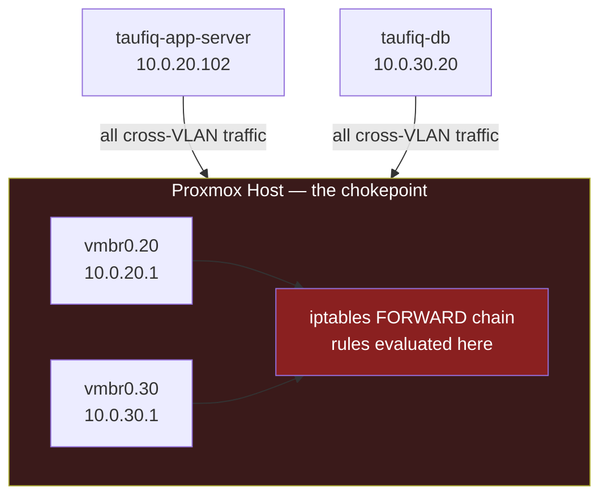

# Module 04 — Why: Linux Routing & Firewalling

---

## Why we did this

After Module 03, VLANs were live — but routing between them was completely open. Any traffic could cross from VLAN 20 to VLAN 30 and back. We had network separation in name only. The database was still reachable on any port from the app server.

A network boundary without firewall rules is decoration. This module made it real.

---

## The gap after Module 03

```
After Module 03 — routing works, but no rules:

  taufiq-app-server          Proxmox Host          taufiq-db
    10.0.20.102              (IP forwarding)         10.0.30.20
         |                         |                     |
         |-- TCP :5432 ----------->|-------------------->|  ✅ intended
         |-- TCP :22 ------------>|-------------------->|  ❌ should be blocked
         |-- TCP :3306 ---------->|-------------------->|  ❌ should be blocked
         |                         |                     |
         |                         |          10.0.30.20 |
         |<-- TCP :80 (initiated)--|<--------------------|  ❌ db should never initiate
```

The principle of least privilege says: only allow what is explicitly needed. Everything else should be denied.

---

## Why the Proxmox host is the right place for the firewall

All traffic between the two VLANs must pass through the Proxmox host kernel — because the host is the router (vmbr0.20 ↔ vmbr0.30). This makes it the single chokepoint where rules are enforced.



There is no other path between the two VMs. If a packet is blocked at FORWARD, it is gone.

---

## Why iptables FORWARD, not INPUT

This is a common point of confusion.

```
INPUT chain:   traffic whose DESTINATION is the Proxmox host itself
               (e.g. SSH into the host, Tailscale traffic to the host)

FORWARD chain: traffic PASSING THROUGH the host to reach another machine
               (e.g. app-server → db across VLANs)

OUTPUT chain:  traffic ORIGINATING from the Proxmox host itself
```

VM-to-VM traffic is forwarded, not destined for the host. FORWARD is the right chain.

---

## Why stateful matching (ESTABLISHED,RELATED) is rule #1

Without stateful matching, allowing a connection in one direction does not automatically allow the reply.

```
Without ESTABLISHED rule:

  app sends TCP SYN to db:5432   --> FORWARD: rule 3 matches, ACCEPT
  db sends TCP SYN-ACK back      --> FORWARD: no rule matches, reaches DROP
  app never receives the reply   --> connection fails
```

```
With ESTABLISHED rule (rule 2):

  app sends TCP SYN to db:5432   --> FORWARD: rule 3 matches, ACCEPT
  db sends TCP SYN-ACK back      --> FORWARD: rule 2 matches (ESTABLISHED), ACCEPT
  connection succeeds            --> ✅
```

The ESTABLISHED rule must be first — before any DROP rules — so reply packets are matched before they hit a deny.

---

## Why we didn't set default policy to DROP

The obvious approach is `iptables -P FORWARD DROP` — deny everything by default, allow specific traffic. But Tailscale adds its own `ts-forward` chain to handle WireGuard traffic. A global default DROP could interfere with that.

```
Safer approach: scoped DROP rules

  Rule 6: DROP src=10.0.20.0/24 dst=10.0.30.0/24   <- only drops VLAN traffic
  Rule 7: DROP src=10.0.30.0/24 dst=10.0.20.0/24

  Tailscale traffic:
    src=100.x.x.x (WireGuard)
    not matched by rules 6 or 7
    hits default ACCEPT policy
    Tailscale ts-forward chain handles it internally
```

The result is identical security for VLAN traffic, without touching Tailscale.

---

## Why db → app is denied entirely

The database should never initiate connections to the application server. This is defence in depth:

- If taufiq-db is compromised, the attacker cannot use it as a pivot point to reach taufiq-app-server
- PostgreSQL has no legitimate reason to make outbound connections to the app tier
- Denying it entirely removes a whole class of potential lateral movement

```
Allowed:     app --> db:5432   (app queries the database)
Blocked:     db --> app:any    (database never calls back)
Blocked:     app --> db:22     (no SSH from app tier into database)
```

---

## What we gained

- The network now enforces least privilege — only PostgreSQL traffic crosses the VLAN boundary
- Deep understanding of the iptables chain model (INPUT vs FORWARD vs OUTPUT)
- Understood why rule order matters (first match wins)
- Understood stateful vs stateless packet filtering
- Understood why scoped DROP rules are safer than a global default DROP when other software (Tailscale) uses the FORWARD chain

---

## The real-world parallel

This is exactly how production database tiers are secured:

```
Production (AWS/Azure/GCP equivalent):

  Security Group on app servers:
    Outbound 5432 to DB subnet: ALLOW
    Outbound 22 to DB subnet: DENY

  Security Group on database servers:
    Inbound 5432 from App subnet: ALLOW
    Inbound anything from App subnet: DENY
    Outbound to App subnet: DENY

  This homelab: same logic, implemented with iptables on a Linux router
                instead of cloud security groups
```

The tool differs. The principle is identical.
