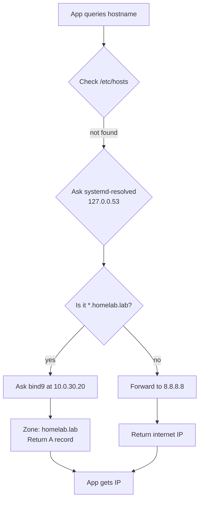

# Module 05 — Completed Notes: DNS Internal Name Resolution

**Date:** 2026-05-12

---

## What was built

bind9 installed on `taufiq-db` as an authoritative nameserver for the `homelab.lab` zone. Both VMs now resolve internal hostnames — no more hardcoded IPs in configs.

---

## Final Network + DNS Topology

```
                        Internet
                            |
                       8.8.8.8 (Google DNS)
                            |
                    Home Router (192.168.0.1)
                            |
              Proxmox Host (192.168.0.10 / vmbr0)
               |                           |
        vmbr0.20 (10.0.20.1)        vmbr0.30 (10.0.30.1)
               |                           |
    taufiq-app-server               taufiq-db
    10.0.20.102                     10.0.30.20
    DNS: 10.0.30.20  <-----------  bind9 :53
                                   authoritative: homelab.lab
                                   forwarder: 8.8.8.8
```

---

## How a Query Resolves

```
taufiq-app-server                taufiq-db (bind9)            Internet
  10.0.20.102                     10.0.30.20:53               8.8.8.8
       |                               |                          |
       |-- "taufiq-db.homelab.lab?" -->|                          |
       |                     zone match: homelab.lab              |
       |<-- "10.0.30.20" -------------|                          |
       |                               |                          |
       |-- "google.com?" ------------->|                          |
       |                     no zone match                        |
       |                               |-- forward to 8.8.8.8 -->|
       |                               |<-- "172.217.x.x" -------|
       |<-- "172.217.x.x" ------------|                          |
```

---

## DNS Resolution Flow (Mermaid)



---

## Zone File Structure

```
$TTL 604800                          <- default time-to-live: 7 days

@  IN  SOA  taufiq-db.homelab.lab.  admin.homelab.lab. (
                2026051201           <- serial: YYYYMMDDNN — increment on every change
                604800               <- refresh: how often secondaries check for updates
                86400                <- retry: if refresh fails, retry after this
                2419200              <- expire: give up after this long without refresh
                604800 )             <- negative TTL: cache "not found" for this long

@           IN  NS   taufiq-db.homelab.lab.   <- nameserver for this zone

taufiq-db         IN  A  10.0.30.20
taufiq-app-server IN  A  10.0.20.102
proxmox           IN  A  192.168.0.10
```

**SOA serial rule:** Always increment the serial when you change the zone file. bind9 uses it to detect changes. Format `YYYYMMDDNN` (NN = change number that day).

---

## Firewall Rules Required

Two layers had to be opened for DNS to work:

```
taufiq-app-server          Proxmox Host FORWARD         taufiq-db UFW
  10.0.20.102                  iptables                  10.0.30.20:53
       |                           |                          |
       |-- UDP/TCP :53 ----------->|                          |
       |           rule: ACCEPT    |-- UDP/TCP :53 ---------->|
       |           (inserted pos 4)|     ufw: ALLOW 10.0.20.0/24 → 53
       |                           |                          |
       |<-- DNS reply -------------|<-- DNS reply ------------|
       |           ESTABLISHED     |                          |
```

**iptables on Proxmox host (inserted before catch-all DROPs):**
```bash
iptables -I FORWARD 4 -s 10.0.20.102 -d 10.0.30.20 -p udp --dport 53 -j ACCEPT
iptables -I FORWARD 5 -s 10.0.20.102 -d 10.0.30.20 -p tcp --dport 53 -j ACCEPT
```

**UFW on taufiq-db:**
```bash
sudo ufw allow from 10.0.20.0/24 to any port 53
```

---

## Commands Reference

### Install bind9
```bash
sudo apt install bind9 bind9utils -y
sudo systemctl status bind9
```

### Configure options
```bash
sudo nano /etc/bind/named.conf.options
```
```
options {
    directory "/var/cache/bind";
    forwarders { 8.8.8.8; 8.8.4.4; };
    forward only;
    listen-on { any; };
    listen-on-v6 { none; };
    allow-query { localhost; 10.0.0.0/8; };
    dnssec-validation no;
};
```

### Declare zone
```bash
sudo nano /etc/bind/named.conf.local
```
```
zone "homelab.lab" {
    type master;
    file "/etc/bind/zones/homelab.lab.db";
};
```

### Create zone file
```bash
sudo mkdir -p /etc/bind/zones
sudo nano /etc/bind/zones/homelab.lab.db
```

### Validate and reload
```bash
sudo named-checkconf
sudo named-checkzone homelab.lab /etc/bind/zones/homelab.lab.db
sudo systemctl reload bind9
```

### Point VMs at bind9
```bash
# /etc/systemd/resolved.conf on each VM
[Resolve]
DNS=10.0.30.20
FallbackDNS=8.8.8.8
Domains=homelab.lab

sudo systemctl restart systemd-resolved
```

### Test
```bash
dig @127.0.0.1 taufiq-db.homelab.lab           # from bind9 host directly
dig taufiq-db.homelab.lab +short                # from any configured VM
dig taufiq-app-server.homelab.lab +short        # cross-VLAN internal
dig google.com +short                           # forwarding works
```

---

## Summary

| Record | Resolves to |
|--------|------------|
| `taufiq-db.homelab.lab` | `10.0.30.20` |
| `taufiq-app-server.homelab.lab` | `10.0.20.102` |
| `proxmox.homelab.lab` | `192.168.0.10` |

| VM | DNS server | Config file |
|----|-----------|-------------|
| taufiq-db | 10.0.30.20 (itself) | `/etc/systemd/resolved.conf` |
| taufiq-app-server | 10.0.30.20 | `/etc/systemd/resolved.conf` |
