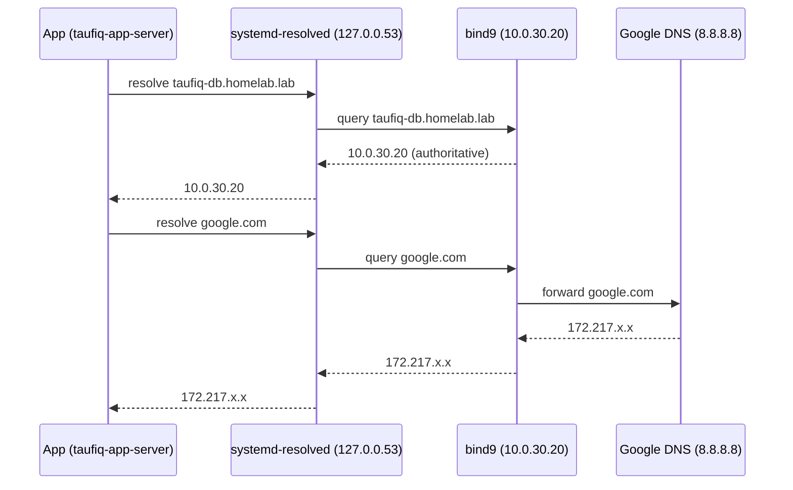

# Module 05 — Worksheet: DNS Internal Name Resolution

---

## Concepts

### What DNS is

DNS maps hostnames to IP addresses. Without it, every config file hardcodes IPs. With DNS, you change one record and everything follows.

```
Without DNS:                     With DNS:
  app config:                      app config:
    db_host = "10.0.30.20"           db_host = "taufiq-db.homelab.lab"
                                              |
  IP changes → update every app      DNS record changes → apps unaffected
```

---

### The two roles

```
┌─────────────────────────────────────────────────────────┐
│                                                         │
│   RESOLVER                    AUTHORITATIVE SERVER      │
│   (client side)               (server side)             │
│                                                         │
│   Asks: "what is              Answers: "I own this      │
│   this hostname?"             zone. Here is the IP."    │
│                                                         │
│   systemd-resolved            bind9                     │
│   /etc/resolv.conf            named.conf + zone files   │
│                                                         │
└─────────────────────────────────────────────────────────┘
```

In this lab, bind9 on taufiq-db is both:
- Authoritative for `homelab.lab` (owns the zone)
- A forwarder for everything else (passes to 8.8.8.8)

---

### DNS query flow



---

### Zone files

A zone file defines the DNS records for a domain. bind9 reads it on startup and reload.

```
$TTL 604800         <- default TTL for all records (seconds). 604800 = 7 days.

@ IN SOA ns. admin. (
    2026051201      <- serial. Must increment every change. Format: YYYYMMDDNN
    604800          <- refresh. How often secondary nameservers check for updates.
    86400           <- retry. If refresh fails, try again after this interval.
    2419200         <- expire. Stop serving zone if no refresh after this long.
    604800 )        <- negative TTL. How long to cache NXDOMAIN responses.

@ IN NS taufiq-db.homelab.lab.    <- NS record: who answers for this zone

; A records — hostname to IPv4
taufiq-db         IN A 10.0.30.20
taufiq-app-server IN A 10.0.20.102
```

**The trailing dot on FQDNs is required.** `taufiq-db.homelab.lab.` (with dot) = absolute. Without dot = relative to the zone origin.

---

### named.conf structure

bind9 splits config across three files:

```
/etc/bind/
├── named.conf              <- root: includes the others
├── named.conf.options      <- global options (listen, forwarders, security)
├── named.conf.local        <- your zones (homelab.lab goes here)
├── named.conf.default-zones <- root hints, localhost zone (don't touch)
└── zones/
    └── homelab.lab.db      <- zone data file
```

---

### systemd-resolved vs /etc/resolv.conf

Ubuntu 24.04 uses systemd-resolved. It manages `/etc/resolv.conf` dynamically — editing that file directly gets overwritten.

```
Correct way:

/etc/systemd/resolved.conf
  [Resolve]
  DNS=10.0.30.20          <- primary nameserver
  FallbackDNS=8.8.8.8     <- if primary unreachable
  Domains=homelab.lab     <- search domain (can query "taufiq-db" instead of FQDN)

sudo systemctl restart systemd-resolved
```

The stub resolver at `127.0.0.53` receives all queries from apps and forwards to the configured DNS server.

---

### Why two firewall layers were needed

DNS from app-server to taufiq-db crosses a VLAN boundary AND hits the VM's local firewall:

```
taufiq-app-server → [iptables FORWARD on Proxmox] → [UFW on taufiq-db] → bind9
```

Both had to be opened:
- iptables: FORWARD allow UDP+TCP 53 from app subnet to db IP
- UFW: allow from 10.0.20.0/24 to port 53

The ESTABLISHED rule handles reply packets automatically.

---

### When to update the zone serial

Every time you edit the zone file, increment the serial. bind9 uses it to detect changes (and secondaries use it to know when to re-transfer).

```
Old: 2026051201
     ^^^^^^^^ ^^
     date     sequence (01 = first change that day)

New: 2026051202  <- second change on same day
New: 2026051301  <- first change next day
```

After editing:
```bash
sudo named-checkzone homelab.lab /etc/bind/zones/homelab.lab.db
sudo systemctl reload bind9   # reload, not restart — keeps cache warm
```

---

## Apply

- [x] Install bind9 and bind9utils
- [x] Configure named.conf.options (forwarders, listen-on, allow-query)
- [x] Declare homelab.lab zone in named.conf.local
- [x] Create zone file with SOA, NS, and A records
- [x] Validate with named-checkconf + named-checkzone
- [x] Reload bind9
- [x] Test from localhost with dig @127.0.0.1
- [x] Open iptables FORWARD for port 53 (UDP+TCP) on Proxmox host
- [x] Open UFW port 53 from 10.0.20.0/24 on taufiq-db
- [x] Configure systemd-resolved on taufiq-app-server
- [x] Configure systemd-resolved on taufiq-db
- [x] Test internal resolution from both VMs
- [x] Test internet forwarding (google.com) from both VMs
- [x] Persist iptables rules
