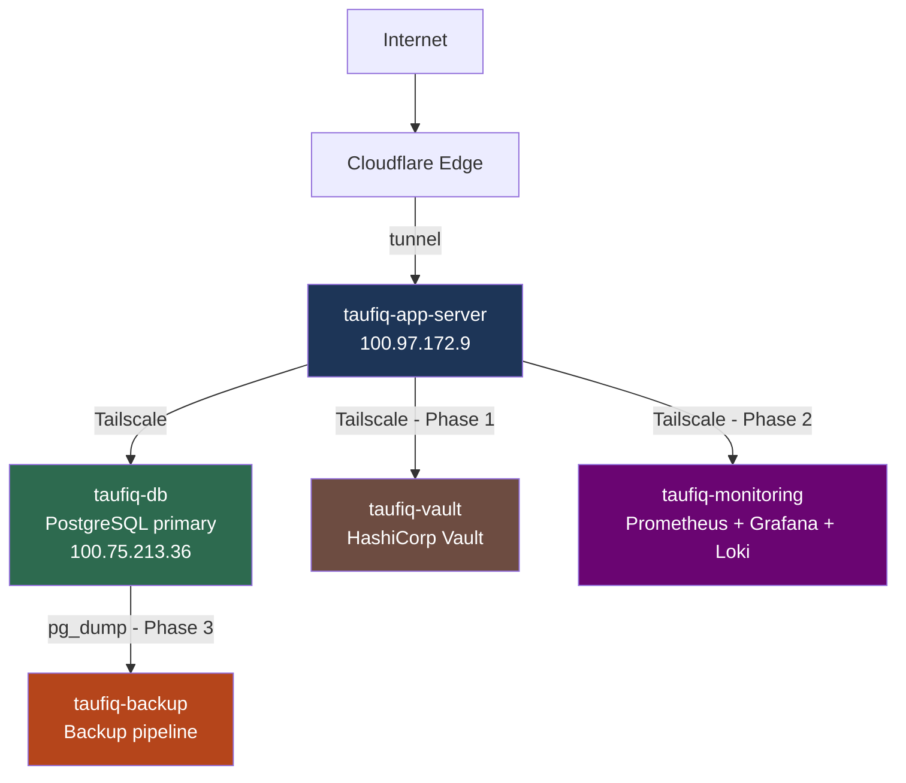

# Homelab Roadmap

**Hardware:** Proxmox VE — i5-6600T, 7.65 GiB RAM, 225 GiB storage
**Domain:** `tttaufiqqq.com` — routed via Cloudflare Tunnel
**Last updated:** 2026-05-11

---

## Current State

| VM / Container | Role | RAM | Status |
|---|---|---|---|
| taufiq-app-server | Docker host, Cloudflare Tunnel | 2 GiB | ✅ Running |
| taufiq-db | PostgreSQL 16 primary | 2 GiB | ✅ Running |
| templatehub container | Customer storefront — port 3000 | — | ✅ Live |
| admin-templatehub container | Admin workspace — port 3001 | — | ✅ Live |
| watchtower | Auto-deploy on image push | — | ✅ Running |

Both apps live at `templatehub.tttaufiqqq.com` and `admin.tttaufiqqq.com`.

---

## Full Infrastructure Target



---

## Resource Allocation Plan

| VM / LXC | Type | RAM | CPU | Storage | Notes |
|---|---|---|---|---|---|
| taufiq-app-server | VM | 1 GiB | 1 core | 10 GiB | Resize from 2 GiB |
| taufiq-db | VM | 1 GiB | 1 core | 20 GiB | Resize from 2 GiB |
| taufiq-vault | VM | 512 MB | 1 core | 8 GiB | New — Phase 1 |
| taufiq-monitoring | LXC | 512 MB | 1 core | 10 GiB | New — Phase 2 |
| taufiq-backup | LXC | 128 MB | 1 core | 5 GiB | New — Phase 3 |
| Proxmox host overhead | — | ~800 MB | — | — | — |
| **Total** | | **~4 GiB / 7.6 GiB** | | **~53 GiB** | 3.6 GiB free |

Enable **memory ballooning** on all VMs — idle VMs release RAM back to the host. Ubuntu/Debian have `virtio-balloon` built in.

**VM vs LXC reasoning:**
- DB replica and Vault → full VMs (data integrity, security isolation)
- Monitoring and Backup → LXC (single-purpose, lightweight, non-sensitive)

---

## Networking Track

Running in parallel with the VM phases. Learn concepts, then apply directly to Proxmox.

See full curriculum: [09-networking/index.md](09-networking/index.md)

| Module | Topic | Status |
|---|---|---|
| 01 | IP Addressing & Subnetting | Concepts done — apply pending |
| 02 | Proxmox Networking Internals | Planned |
| 03 | VLANs & Network Segmentation | Planned |
| 04 | pfSense — Firewall & Router | Planned |
| 05 | DNS — Internal Name Resolution | Planned |
| 06 | Reverse Proxy — Nginx | Planned |
| 07 | Load Balancing — HAProxy | Planned |

**Recommended start:** Module 02 (audit current Proxmox interfaces) → Module 03 (VLANs) → Module 04 (pfSense).

---

## Pre-work (before adding new VMs)

- [ ] Resize taufiq-app-server RAM: 2 GiB → 1 GiB (Proxmox Hardware tab, requires shutdown)
- [ ] Resize taufiq-db RAM: 2 GiB → 1 GiB (requires shutdown)
- [ ] Verify both VMs healthy after resize

---

## Phase 1 — HashiCorp Vault (Secrets Management)

**Goal:** Replace `.env` files on app-server with runtime secret fetching. Every secret access is logged.
**New VM:** `taufiq-vault` — 512 MB RAM, 1 core, 8 GiB, Ubuntu 24.04
**URL:** `vault.tttaufiqqq.com` (add to Cloudflare tunnel ingress)

```
Current (dangerous):
  .env file on disk → DATABASE_URL, TOYYIBPAY_KEY, SESSION_SECRET visible to anyone with server access

With Vault:
  App starts → requests secret from Vault → Vault checks AppRole identity → returns secret
  Every access logged with timestamp + requester
```

**Secret structure:**
```
vault/
├── secret/templatehub/
│     DATABASE_URL, TOYYIBPAY_USER_SECRET_KEY, TOYYIBPAY_CATEGORY_CODE
│     ADMIN_SESSION_SECRET, CUSTOMER_SESSION_SECRET, ADMIN_BOOTSTRAP_PASSWORD
└── secret/admin-templatehub/
      DATABASE_URL, ADMIN_SESSION_SECRET, ADMIN_BOOTSTRAP_PASSWORD
```

**Checklist:**
- [ ] Create taufiq-vault VM
- [ ] Install Ubuntu 24.04 + Tailscale
- [ ] Install and initialise HashiCorp Vault
- [ ] Add `vault.tttaufiqqq.com` to Cloudflare tunnel config
- [ ] Configure KV secret engine
- [ ] Configure AppRole auth for taufiq-app-server
- [ ] Migrate TemplateHub secrets from .env files into Vault
- [ ] Update TemplateHub + admin app to fetch secrets from Vault at startup
- [ ] Verify audit log captures every secret read
- [ ] Remove .env files from app-server

**Skills learned:** Secrets management, AppRole auth, dynamic credentials, audit logging, least privilege

---

## Phase 2 — Observability Stack

**Goal:** Visibility into app behaviour and database health. Essential before handling real traffic at volume.
**New LXC:** `taufiq-monitoring` — 512 MB RAM, 1 core, 10 GiB
**URL:** `monitoring.tttaufiqqq.com` (add to Cloudflare tunnel ingress)
**Stack:** Prometheus + Grafana + Loki

**What to monitor for TemplateHub:**

| Metric | Source |
|---|---|
| Order creation rate | App metrics |
| Payment callback success/failure | App metrics |
| Protected download request volume | App metrics |
| PostgreSQL query performance | postgres_exporter |
| PostgreSQL replication lag (if applicable) | postgres_exporter |
| App server CPU + memory | Node exporter |
| Cloudflare Tunnel connection health | cloudflared metrics |

**Checklist:**
- [ ] Create taufiq-monitoring LXC
- [ ] Install Tailscale
- [ ] Install Prometheus
- [ ] Install Grafana
- [ ] Install Loki
- [ ] Add postgres_exporter to taufiq-db
- [ ] Add node_exporter to taufiq-app-server and taufiq-db
- [ ] Add `monitoring.tttaufiqqq.com` to Cloudflare tunnel
- [ ] Build Grafana dashboard for TemplateHub metrics
- [ ] Build Grafana dashboard for PostgreSQL health
- [ ] Connect Loki to collect logs from all VMs
- [ ] Set up Alertmanager — notify when services go down

**Skills learned:** Prometheus metrics, Grafana dashboards, Loki log aggregation, alerting, time-series data

---

## Phase 3 — PostgreSQL Backup Pipeline

**Goal:** Automated, verified backups with documented restore procedures. A backup never restored is not a backup.
**New LXC:** `taufiq-backup` — 128 MB RAM, 1 core, 5 GiB

```
Cron (daily 2AM)
    │
    ▼
pg_dump → taufiq-db (via Tailscale)
    │
    ▼
Compress (gzip)
    │
    ▼
Store locally + optional offsite
    │
    ▼
Verify dump integrity
    │
    ▼
Log result → Loki
```

**Backup types:**
- Full backup — complete `pg_dump` daily
- Retention policy — 7 daily, 4 weekly, 3 monthly

**Checklist:**
- [ ] Create taufiq-backup LXC
- [ ] Install Tailscale
- [ ] Write pg_dump backup script
- [ ] Schedule via cron
- [ ] Implement retention policy (7/4/3)
- [ ] Test restore drill — dump into a fresh DB, verify data integrity
- [ ] Document restore runbook clearly
- [ ] Connect backup logs to Loki (Phase 2 required)

**Skills learned:** pg_dump, restore drills, retention policies, cron pipelines

---

## Phase 5+ — Future

| Project | What | Why |
|---|---|---|
| Apache Kafka | Message streaming broker | Core data engineering tool |
| k6 Load Testing | Simulate concurrent buyers on TemplateHub | Capacity planning, DB connection pool tuning |
| Gitea + Woodpecker | Self-hosted Git + CI/CD | Learn how CI/CD infrastructure is built |

---

## Implementation Order Summary

```
Pre-work (now)
  └── Resize VMs: 2 GiB → 1 GiB each

Phase 1 (next)
  └── HashiCorp Vault (taufiq-vault)
  └── Migrate TemplateHub secrets off .env

Phase 2
  └── Observability stack (taufiq-monitoring)
  └── Prometheus + Grafana + Loki

Phase 3
  └── Backup pipeline (taufiq-backup)
  └── Restore drills

Phase 4+
  └── Kafka, load testing, self-hosted CI/CD
```
